# ⚔️ Clash of Clans Clone (部落冲突复刻项目)

**一个基于 Cocos2d-x 引擎的《部落冲突》复刻项目**

[功能特性](#-功能特性) • [快速开始](#-快速开始) • [项目结构](#-项目结构) • [开发文档](#-开发文档)

## 🌟 项目简介 (Project Overview)

本项目是同济大学软件工程课程的小组作业，使用 **C++17** 和 **Cocos2d-x 3.17.2** 引擎从零开始复刻《部落冲突》的核心玩法。项目采用 **MVC 架构**设计，实现了村庄建设、资源管理、兵种训练、智能战斗等完整游戏循环，并成功移植到 Android 平台。

### 🎯 项目目标

- ✅ 深入理解游戏架构设计与模块化开发
- ✅ 掌握 C++ 在实际工程中的应用
- ✅ 实践跨平台游戏开发技术
- ✅ 体验团队协作与版本控制流程
---

## 👥 项目成员 (Team Members)

| 姓名   | 学号    | 主要职责           | 贡献度          |
| ------ | ------- | -------------- | ----------------------- |
| 蒋昊沄 | 2450333 | <ul><li>项目架构</li><li>代码审查</li><li>村庄资源管理系统 `VillageDataManager类`</li><li>资源离线生产与收集系统 `ResourceProductionManager类`，`ResourceCollection类`<li>资源显示UI `HUDLayer类`</li></li><li>建筑建造放置系统 `BuildingPlacementController类`，`ConstructionAnimation类`，`BuildingSprite类`</li><li>存档系统</li><li>战斗动画配置 `AnimationManager类`，`DefenseBuildingAnimation类`</li><li>战斗进度显示 `BattleProgressUI类`</li><li>回放系统 `ReplayManager类`，`BattleRecorder类`，`ReplayListLayer类`</li> </ul> | 33.4% |
| 李柏言 | 2452281 | <ul><li>等距网格系统`GridMapUtils类`</li><li>建筑移动 `MoveBuildingController类`</li><li>战斗系统 `BAttleProcessController类`</li><li>战斗摧毁系统 `DestructionTracker类`</li><li>A* 寻路算法`FindPathUtils类`</li><li>防御建筑系统 `DefenseSystem类`</li><li>陷阱系统 `TrapSystem类`</li><li>音效集成 `AudioManager类`</li></ul>| 33.3% |
| 桑治   | 2451200 | <ul><li>商店系统 `ShopLayer类`</li><li>训练营`TrainingLayer类`</li><li>实验室 `LaboratoryLayer类`</li><li>兵种信息配置 `TroopConfig类`，`TroopUpgradeConfig类`</li><li>战斗地图生成`RandomBattleMApGenerator类`</li><li>战斗模式场景搭建 `BattleScene类`</li><li>战斗生命值组件 `HealthBarComponent类`</li><li>开发者模式 `DebugerHelper类`，`DebugLayer类`</li><li>**Android 移植**</li>  </ul> | 33.3%|

|姓名|commit次数(no-merges)|有效代码行数|
|:--:|:--:|:--:|
|蒋昊沄|48|10748|
|桑治|17|6902|
|李柏言|14|3938|

---

## 🎬 项目演示 (Demo)

### 1. 启动界面

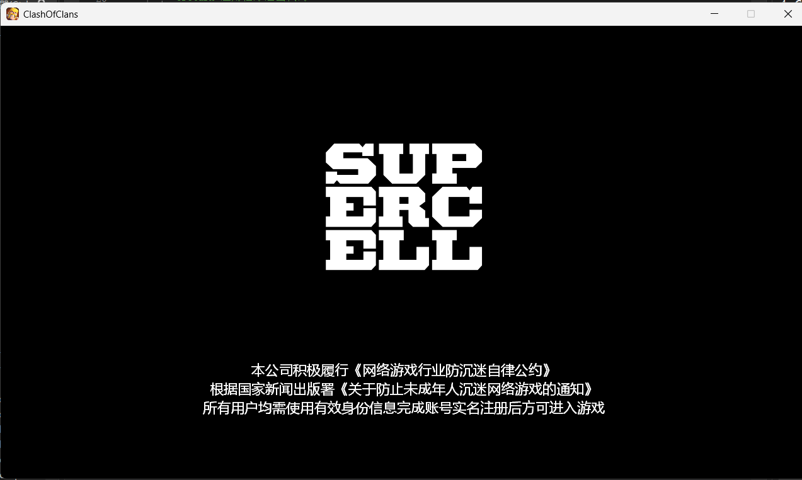

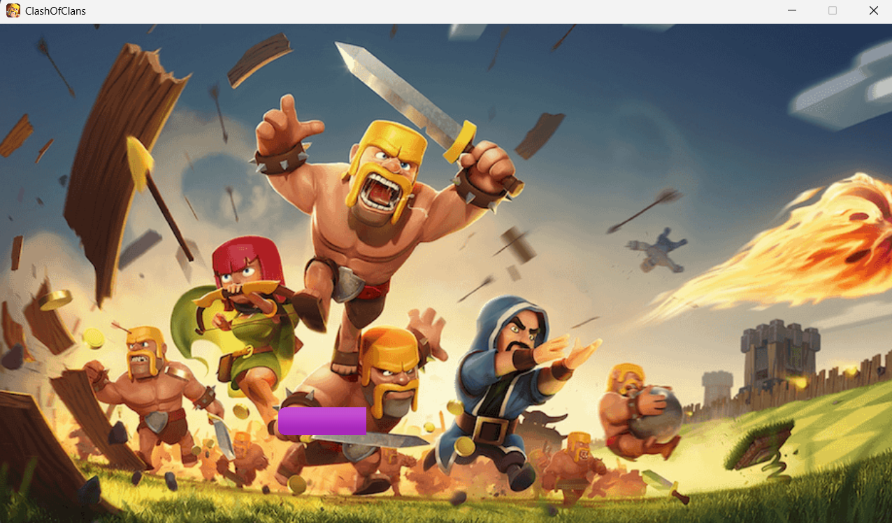

*图1：游戏启动界面，展示 Logo 动画和加载进度*

### 2. 村庄主界面

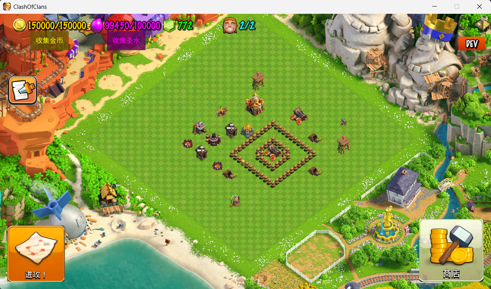

*图2：村庄主界面，包含建筑布局、资源显示、功能按钮*

### 3. 商店界面

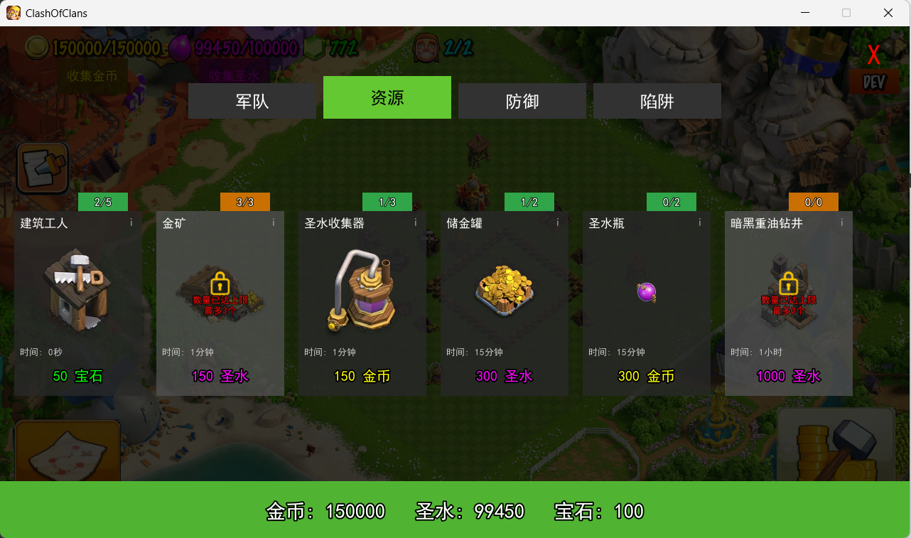

*图3：商店界面，分类展示可购买的建筑*

### 4. 训练界面

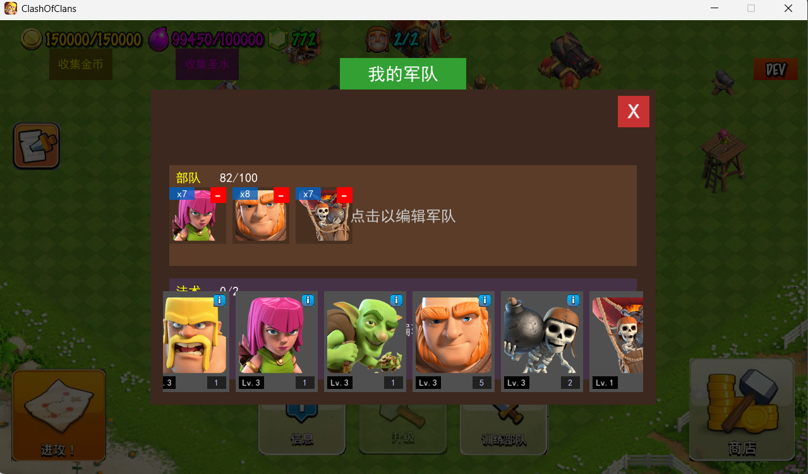

*图4：兵种训练界面，显示可训练兵种和当前容量*

### 5. 实验室界面

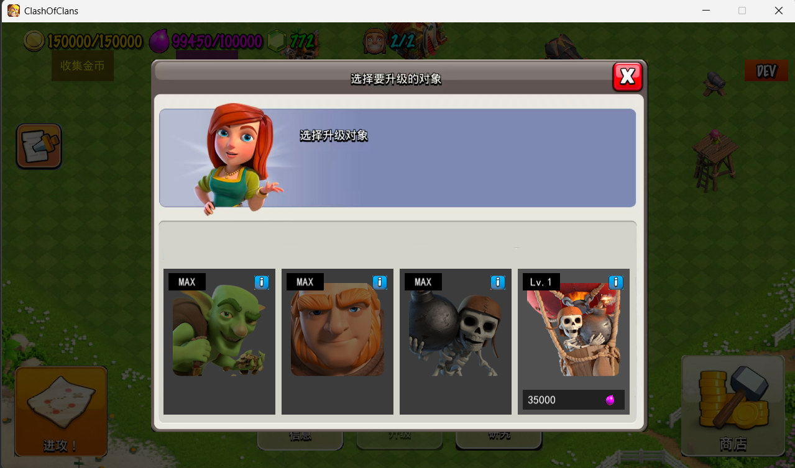

*图5：实验室界面，用于兵种升级研究*

### 6. 战斗准备界面

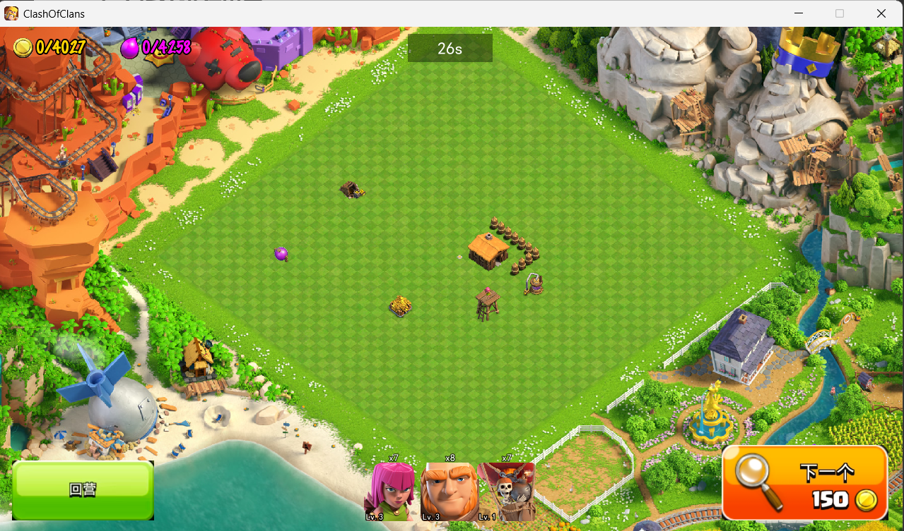

*图6：战斗准备阶段，查看敌方布局，30秒侦查时间*

### 7. 战斗进行界面

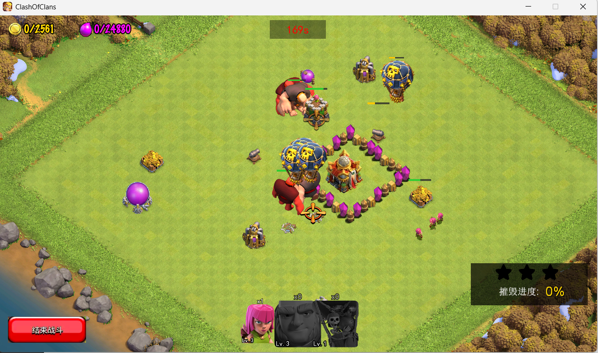

*图7：战斗进行中，兵种自动寻路攻击建筑*

### 8. 战斗结算界面

*图8：战斗结算界面，显示战斗结果和资源掠夺*

### 9. 回放列表界面

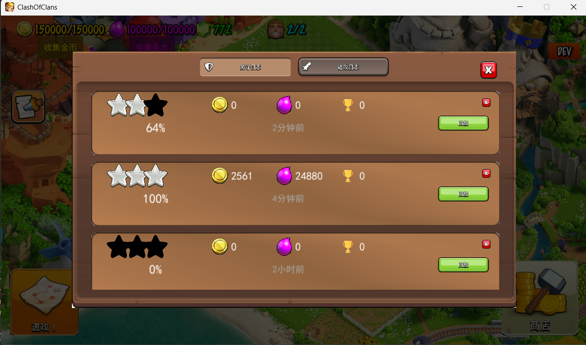

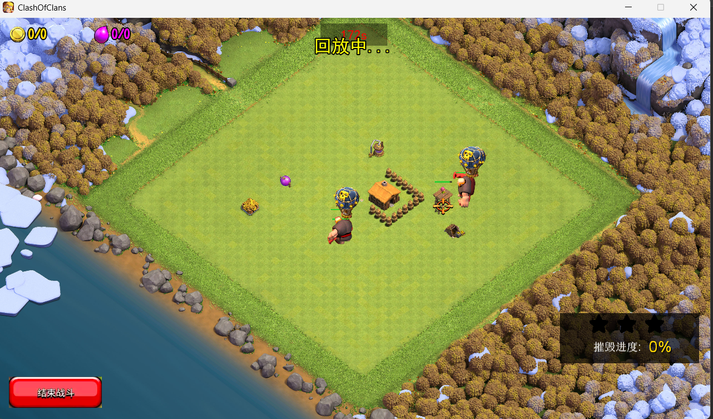

*图9：回放列表与回放播放界面*

### 10. Android 运行效果

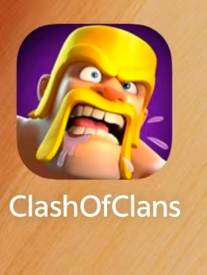

*图10：游戏在 Android 设备上的运行效果*

---

## 🎯 核心功能与规划 (Features & Planning)

#### 村庄系统
- [x] 大本营等级系统（1-5 级）
- [x] 三类资源管理（金币、圣水、人口）
- [x] 建筑放置与拖动（等距网格系统）
- [x] 建筑升级系统（支持多级升级）
- [x] 建筑施工时间（可用钻石加速）
- [x] 自动存档/读档功能

#### 建筑类型
- [x] **资源建筑**：大本营、金矿、圣水收集器
- [x] **军事建筑**：兵营、训练营、实验室
- [x] **防御建筑**：加农炮、箭塔、城墙
- [x] **陷阱建筑**：炸弹、巨型炸弹

#### 战斗系统
- [x] 完整战斗流程（30s 侦查 + 180s 战斗）
- [x] 随机生成对手村庄（程序化地图）
- [x] 兵种智能 AI（A* 寻路 + 目标优先级）
- [x] 破墙逻辑（距离对比算法）
- [x] 防御建筑自动反击
- [x] 陷阱触发机制
- [x] 星级评价系统（摧毁率判定）

#### 兵种系统
- [x] **野蛮人**：近战肉盾，攻击任意目标
- [x] **弓箭手**：远程输出，3 格攻击距离
- [x] **哥布林**：快速掠夺，优先攻击资源建筑
- [x] **巨人**：高血量坦克，优先攻击防御建筑
- [x] **炸弹人**：破墙专家，对城墙 10 倍伤害
- [x] **气球兵**：天空单位，飞行无视城墙

#### 其他系统
- [x] 回放系统（保存最近 10 场战斗）
- [x] 商店系统（建筑购买、资源购买）
- [x] 训练营（兵种训练）
- [x] 实验室（兵种升级）
- [x] 背景音乐与战斗音效
- [x] 8 方向动画系统

---

## 🛠️ 技术栈 (Tech Stack)

| 领域         | 技术/工具             | 详情                       |
| :---         | :---                  | :---                       |
| 游戏引擎     | Cocos2d-x (C++)       | 跨平台 2D 游戏开发框架     |
| 主语言       | C++17/C++20           | 游戏逻辑实现               |
| 构建系统     | CMake                 | 跨平台项目配置与构建       |
| 版本控制   | Git + GitHub           | 团队协作  |
| 主要 IDE     | Visual Studio 2022    | Windows 平台编译与调试     |

---
## 开发日志
### 11.25-11.28
- 配置 cocos2dx 3.17.2 环境
- 学习 `CMake` 工具
- 规定 Git & GitHub 合作工作流
### 11.29
- 建立仓库
- 创建村庄场景
- 收集 COC 图片资源
### 11.30
- 初步搭建村庄场景
- 添加 `VillageScene`, `VillageLayer`, `HUDLayer`
- 实现鼠标缩放地图
### 12.2
- 实现启动界面
- 优化滚轮功能
- 改进网格系统
### 12.4
- 完善缩放地图操作
### 12.5
- 深度讨论，明确`MVC`架构
- 重构部分功能进`controller`
- 完成商店开发
### 12.6
- 构建村庄资源系统
### 12.7
- 实现建筑建造
- 实现商店购买建筑
### 12.8
- 正式完成网格系统
- 完善建筑显示
### 12.10
- 配置野蛮人动画
- 优化建筑移动
- 优化图片资源占用，使用精灵图集
### 12.11
- 存档系统
- 资源生产系统
### 12.12
- 建筑建造过程优化
- 寻路函数工具准备
- 完成兵种训练逻辑
- 完成兵种升级逻辑
- 完成人口容量逻辑
### 12.13
- 搭建战斗模式框架
- 实现跳过建筑建造时间
- 修复跳过建筑建造时间bug
### 12.14
- 重构代码，维护内存安全性
- 实现购买建筑和升级建筑的限制逻辑
- 修正建筑显示`zorder`
- 优化城墙的放置
### 12.15
- 建筑工人小屋和建筑工人数量配置
- 统一文件编码
- 资源标签显示
- 增加调试模式
### 12.16
- 实验室升级兵种实现
- 完成野蛮人寻路功能
- `battleprocesscontroller`重构
### 12.17
- 完成六种兵种的寻路算法
- 完善战斗场景
### 12.18
- 战斗场景优化
### 12.19
- 配置加农炮炮口旋转动画
- 配置箭塔显示
- 实现建筑ai逻辑
- 配置攻城炸弹兵和气球兵动画
### 12.20
- 安卓移植适配
- 生命值组件打包
- 修复气球兵显示层级
- 修复炸弹兵攻击逻辑
- 修复加农炮炮口旋转偏差
### 12.21
- 增加战斗摧毁进度UI
- 增加战斗获得星星
- 修复哥布林动画
- 完成陷阱系统，结束战斗模式
- 完成回放系统
### 12.22
- 增加场景切换娱乐模式
### 12.23
- 修复雪花粒子效果造成的悬挂指针问题
### 12.24
- 配置音乐音效
- 修复摧毁进度bug
### 12.25
- 重构代码
- 增加游戏icon图标
### 12.26
- 修复回放系统
- 完成Android编译
- 实现长按连续操作
### 12.27
- 修改代码规范
- 修复Android下屏幕黑边问题

---
## 🙏 致谢

- 感谢 [Cocos2d-x](https://www.cocos.com/en/cocos2dx) 提供优秀的游戏引擎
- 感谢 Supercell 创造了《部落冲突》这款伟大的游戏
- 感谢课程老师的指导与建议
- 感谢所有为开源社区做出贡献的开发者

---

**⭐ 如果这个项目对你有帮助，请给我们一个 Star！⭐**

